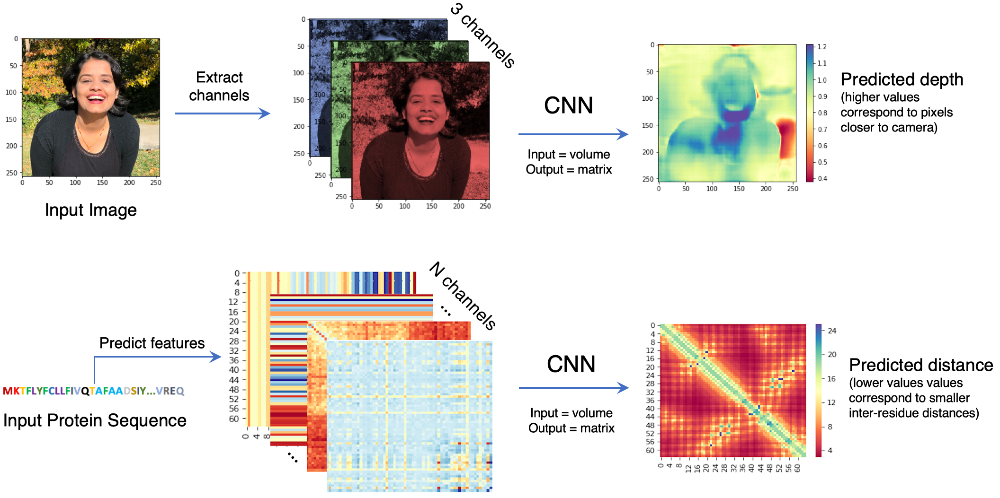

# PDNET
## A fully open-source framework for deep learning protein real-valued distances

As deep learning algorithms drive the progress in protein structure prediction, a lot remains to be studied at this emerging crossway of deep learning and protein structure prediction. Recent findings show that inter-residue distance prediction, a more granular version of the well-known contact prediction problem, is a key to predict accurate models. We believe that deep learning methods that predict these distances are still at infancy. To advance these methods and develop other novel methods, we need a small and representative dataset packaged for fast development and testing. In this work, we introduce Protein Distance Net (PDNET), a dataset derived from the widely used DeepCov dataset and consists of 3456 representative protein chains for training and validation. It is packaged with all the scripts that were used to curate the dataset, generate the input features and distance maps, and scripts with deep learning models to train, validate and test. Deep learning models can also be trained and tested in a web browser using free platforms such as Google Colab. We discuss how this dataset can be used to predict contacts, distance intervals, and real-valued distances (in Angstroms) by designing regression models.

Full dataset at: http://deep.cs.umsl.edu/pdnet/  

Badri Adhikari  
https://badriadhikari.github.io/  

(Figure above) Comparison of the protein inter-residue distance prediction problem with the 'depth prediction from single
image problem' in computer vision. In both problems the input to the deep learning model is a volume and the
output is a 2D matrix. The depth predictions for this specific image (top right corner) were obtained by running the
pretrained FCRN method.
